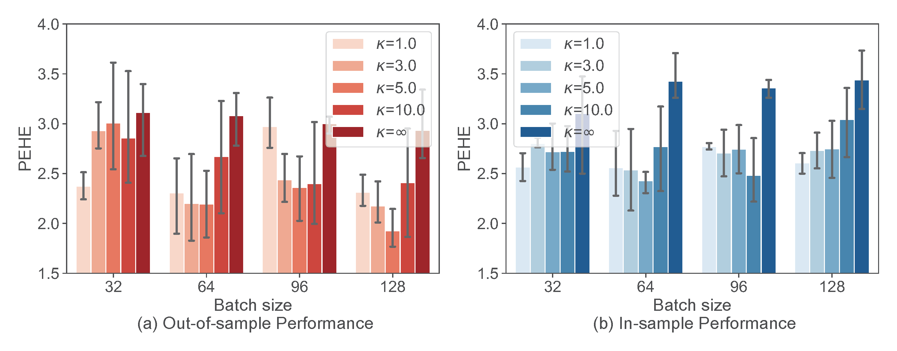
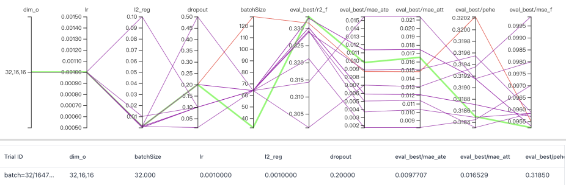
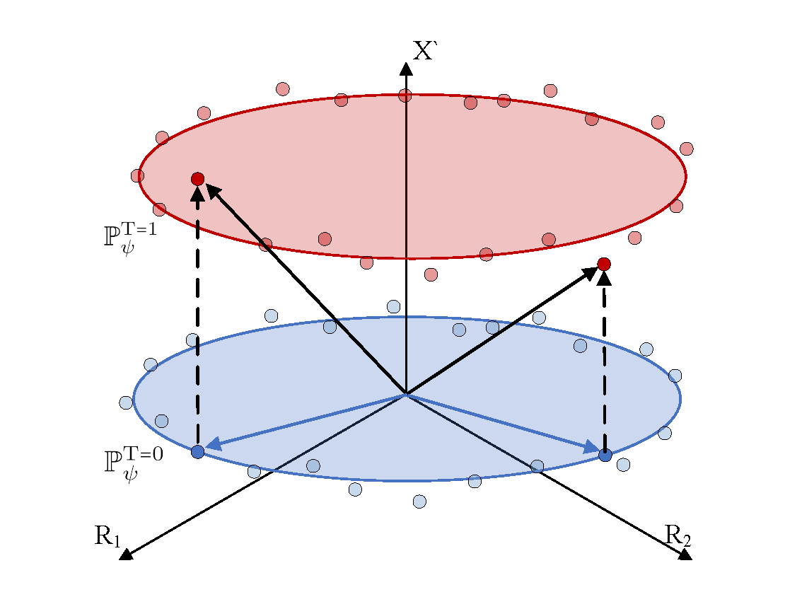
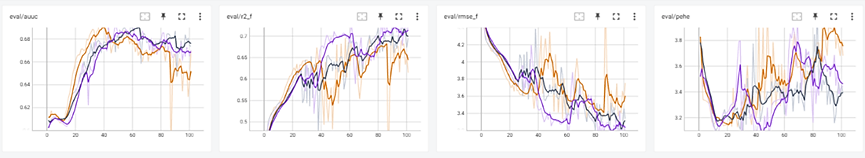

# Materials for Response letter
## General Response
This is the supporting material for the comment 2 of reviewer 1 and the comment 4, comment 6 of reviewer 3.
 

The figure above reports the PEHE of ESCFR under different hyper-parameter $\kappa$. 
- All ESCFR implementations outperform the strongest baseline CFR-WASS ( $\kappa=\infty$) on all batch sizes, most of which are statistically significant. As such, hyper-parameter is not necessarily the reason why ESCFR works well. This can be further supported by our extensive ablation and parameter studies in the manuscript.
- The optimal value of $\kappa$ increases with increasing batch size. For example, the optimal $\kappa$ is 1.0 for batchsize=32, and 5.0 for batchsize=128. It supports our claim in Section 3.2 of the manuscript. Specifically, for small batch sizes, where sampling outliers dominate the sampled batches, a small $\kappa$ can effectively relax the mass preservation constraint and avoid mis-matching outliers, thus performing optimally and robustly. For large batch sizes, the noise of sampling outliers is reduced, and it is reasonable to increase $\kappa$ to match more sample masses and obtain more accurate Wasserstein distance estimates.
- Even with large batch sizes, oversized $\kappa$ does not perform well. Although the effect of sampling outliers is reduced, some patterns such as outcome imbalance are always present for all batch sizes, contributing to false matching given strong mass preserving constraint. As such, it is reasonable to witness this upper bound on best $\kappa$ that is independent of batch size.

## Reviewer #1
### Comment 2
Since accurate estimation of factual outcomes is the basis for causal inference, the batchsize, as well as learning rate, was finetuned based on TARNet at the very beginning, to improve the performance of factual estimation. We selected batchsize=32 due to its superior factual accuracy (R2, MSE of factual outcome estimation) on evaluation set. We provide the corresponding raw logs as follow.

 

Please check the general response for the experiment results on large batch sizes.
## Reviewer #2
### Comment 3

One major concern would be the overall complexity of solving discrete optimal transport problem. 
Exact algorithms, e.g. the interior-point method and network-simplex method, suffer from heavy computational cost of $\mathcal{O}(n^3\log n)$.
An entropic regularizer is thus introduced, making the problem solvable by the Sinkhorn algorithm in Algorithm 1.
The complexity is $\mathcal{O}(n^2/\epsilon^2)$ in terms of the absolute error of the mass preservation constraints, which can be further accelerated with greedy algorithm. 

The table below reports the practical running time at the commonly-used batch settings. 
In general, the computational cost of optimal transmission is not a concern at the mini-batch level.

| Batch size | 32            | 64            | 128           | 256           | 512           | 1024           |
|------------|---------------|---------------|---------------|---------------|---------------|----------------|
| Algorithm1 | 0.0266+0.0102 | 0.0241+0.0075 | 0.0326+0.0088 | 0.0499+0.0099 | 0.0725+0.0128 | 0.1430+0.0259  |
| Algorithm2 | 0.0050+0.0004 | 0.0051+0.0001 | 0.0065+0.0002 | 0.0104+0.0005 | 0.0138+0.0008 | 0.0256+0.0007  |

Notice that enlarging $\epsilon$ further speeds up the computation while making the resulting transfer matrix biased, hindering the transportation performance. 

| Parameter   | $\epsilon$=0.1 | $\epsilon$=0.5 | $\epsilon$=1.0 | $\epsilon$=5.0 | $\epsilon$=10.0 | $\epsilon$=100.0  |
|-------------|----------------|----------------|----------------|----------------|-----------------|-------------------|
| Algorithm l | 0.1683+0.0038  | 0.1207+0.0102  | 0.0699+0.0095  | 0.0153+0.0013  | 0.0097+0.0009   | 0.0072+0.0009     |
| Algorithm 2 | 0.0166+0.0019  | 0.0068+0.0010  | 0.0052+0.0011  | 0.0047+0.0010  | 0.0045+0.0011   | 0.0043+0.0009     |

Entropic regularization is still applicable to speed up the solution of the unbalanced optimal transport problem in RMPR, represented by the Sinkhorn-like algorithm in Algorithm 2. 
Existing wor has proved that its total complexity is $\tilde{\mathcal{O}}(n^2/\epsilon)$.
In addition, large relaxation parameter $\kappa$ makes the computed results more consistent to that by Sinkhorn algorithm, significantly contributes to more iterations.

| Parameter   | $\kappa$=0.1  | $\kappa$=0.5  | $\kappa$=1.0  | $\kappa$=5.0  | $\kappa$=10.0 | $\kappa$=100.0  |
|-------------|---------------|---------------|---------------|---------------|---------------|-----------------|
| Algorithm 2 | 0.0050+0.0011 | 0.0059+0.0008 | 0.0060+0.0011 | 0.0112+0.0014 | 0.0162+0.0016 | 0.1039+0.0033   |

## Reviewer #3
### Comment 2
 

A toy example is provided with visualization above. Let the ground truth $Y:=\sqrt{R_1^2+R_2^2+X^{\prime 2}}$ where $T$ is omitted as we only consider one group, $R_1$ and $R_2$ are the representations of observed confounders that have been aligned with Sinkhorn algorithm. Let the unobserved $X^\prime=0$ for control groups and $X^\prime=1$ for treated groups, which makes $X^\prime$ an unobserved confounder as it is related to Y and different between treatment groups. We find given balanced $R_1$ and $R_2$, the variation of $X^\prime$ is reflected by the variation of $Y$. As such, it is reasonable to employ $Y$ to calibrate $X^\prime$.

### Comment 3

### Comment 4
 

### Comment 6
Please check the general response for the performance of ESCFR and baselines on different batch sizes.

